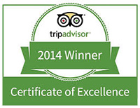
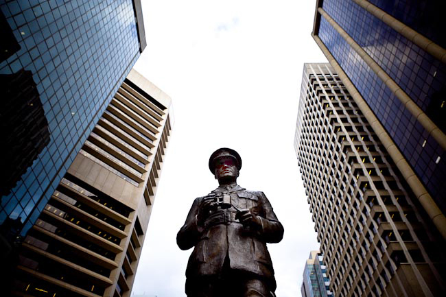
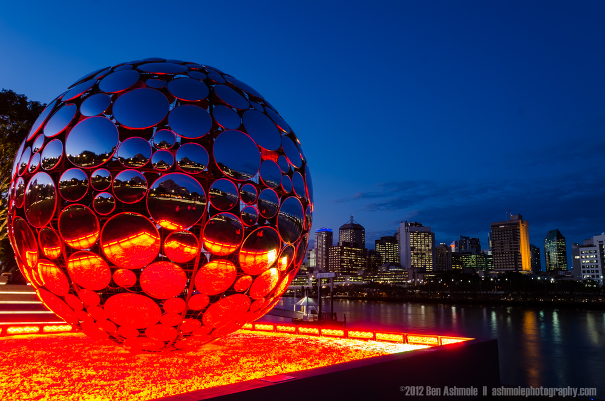
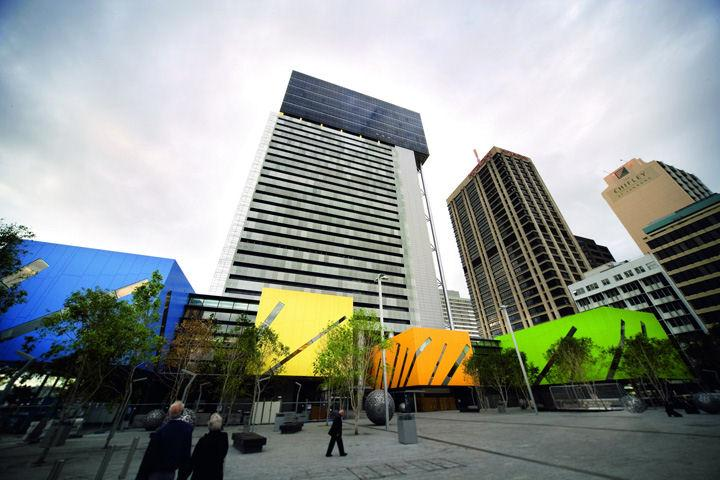

<!DOCTYPE html>
<html lang="en">
<head>

<meta charset="UTF-8">
<meta name="viewport" content="width=device-width, initial-scale=1.0">
<link rel="stylesheet" href="https://www.w3schools.com/w3css/4/w3.css">
<link rel="stylesheet" href="main.css">
<title>Brisbane Photo Safari</title>
</head>

<body>

    <nav>

       <ul>
            <li style="background-color: #64a0a0;" class="w3-bar-item w3-button"><a href="#">PHOTO SAFARIS</a></li>
            <li style="background-color: #aabe61;" class="w3-bar-item w3-button"><a href="#">REGISTRATION</a></li>
            <li style="background-color: #FF8900;" class="w3-bar-item w3-button"><a href="#">INFO</a></li>
            <li style="background-color: #C6F;" class="w3-bar-item w3-button"><a href="#">PHOTO TIPS</a></li>
            <li style="background-color: #8C091E;" class="w3-bar-item w3-button"><a href="#">GALLERY</a></li>
       </ul>

    </nav>
    <header>

        

    </header>
    

        <main class="w3-twothird">

            

            <h1>Join a Brisbane City Photo Safari</h1>
 
            
 There's more than meets the eye in Brisbane City. But perfect for the camera. From King George Square to Mount Cootha, from the Kurilpa Bridge to Southbank, Photo Safaris are unique photo classes for small groups & individuals who want to learn how to capture the allure that's distinctly Brisvegas. While using BNE as both backdrop and classroom, these photography workshops provide unique photographic opportunities to sharpen your skills and capture memories for a lifetime. Groups are small, so you'll get hands on instruction on how to use your camera and compose your pictures from an experienced professional photographer.

            <h2>Pack your camera and book a Photo Safari today!</h2>
 
            
Over 4500 participants from 45+ countries & 500+ cities have joined our photo tours.

        </main>
        <aside class="w3-third">
            <h4 style="color: white; background-color: navy; padding-left: 5px;">What People are Saying</h4>
 
            
"Fun and informative" - Pawan D (UK)

            
"Absolute highlight of our trip, really highly recommended" - Josh (Sth Africa)

            
"Great experience for beginners or experts!" - Rory Quinn (Baltimore)

            
"BNE Photo Safari - outstanding value" - Chelsea S (Sydney)

            
"Make BNE Photo Safari your first stop" - Midhun (India)

            
"Best Photography Class in Brisbane" - Sara (Toowong, Brisbane)

        </aside>
    

    

        
        
        

    

    <footer>
        

        

            All pages and materials displayed on this page are copyrighted. 
            &copy; 2009-2014 Brisbane Photo Safari. All rights reserved. All logos are Registered trademarks.
        

    
    
    
    
    
    
    </footer>

</body>
</html>
